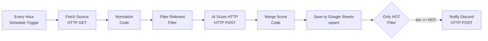
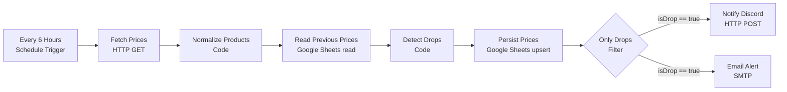

# n8n Templates, FluxLab

Two ready-to-import, production-shaped n8n workflows. Core nodes only, no community
packages, inline notes on every step. Each is validated in CI.

| Workflow            | File                                 | Nodes | What it does                                                                                                      |
| ------------------- | ------------------------------------ | ----- | ----------------------------------------------------------------------------------------------------------------- |
| Lead & Deal Watcher | `workflow.json`                      | 9     | Fetch source, AI-score each item, log to Google Sheets, ping Discord/Slack about the hot ones.                    |
| Price Drop Monitor  | `workflow-2-price-drop-monitor.json` | 9     | Fetch prices, compare against the last run (stateful, via Google Sheets), alert on real drops by Discord + email. |

---

## Workflow 1, Lead & Deal Watcher

Cyklicznie pobiera nowe pozycje ze źródła (HTTP/API/RSS-as-JSON), normalizuje je,
odfiltrowuje istotne, ocenia je modelem AI (relevance score 0-100), zapisuje do
Google Sheets (upsert, bez duplikatów) i wysyła powiadomienie o najgorętszych
trafieniach na Discord/Slack.

### Diagram



### Node'y

| #   | Node                  | Typ             | Rola                                                                         |
| --- | --------------------- | --------------- | ---------------------------------------------------------------------------- |
| 1   | Every Hour            | scheduleTrigger | Uruchamia pipeline co godzinę.                                               |
| 2   | Fetch Source          | httpRequest     | HTTP GET do dowolnego źródła JSON (demo: Hacker News Algolia API).           |
| 3   | Normalize             | code            | Spłaszcza payload do jednego czystego itemu na wiersz. Tu adaptujesz źródło. |
| 4   | Filter Relevant       | filter          | Odrzuca pozycje bez URL / poniżej progu.                                     |
| 5   | AI Score (HTTP)       | httpRequest     | POST do endpointu OpenAI-compatible, zwraca `{score, reason}`.               |
| 6   | Merge Score           | code            | Dokleja score + reason, liczy tier HOT/WARM/COLD.                            |
| 7   | Save to Google Sheets | googleSheets    | Upsert po kolumnie `id` (re-run nie duplikuje).                              |
| 8   | Only HOT              | filter          | Przepuszcza tylko `tier == HOT`.                                             |
| 9   | Notify Discord        | httpRequest     | POST na webhook Discord/Slack.                                               |

### Credentiale

| Node                  | Typ credentiala      | Co ustawić                                             |
| --------------------- | -------------------- | ------------------------------------------------------ |
| AI Score (HTTP)       | Header Auth          | Name: `Authorization`, Value: `Bearer <TWÓJ_API_KEY>`. |
| Save to Google Sheets | Google Sheets OAuth2 | Zaloguj konto Google, nadaj dostęp do arkuszy.         |

### n8n Variables

- `SOURCE_URL`, Twój endpoint źródłowy (nadpisuje demo HN).
- `DISCORD_WEBHOOK_URL`, webhook Discord (lub Slack).

Node'y czytają je przez `{{ $vars.SOURCE_URL }}` / `{{ $vars.DISCORD_WEBHOOK_URL }}`.
Na darmowym self-hosted bez zmiennych, po prostu wpisz URL-e wprost w polach node'ów.

### Google Sheet, nagłówki

Zakładka `Sheet1`, pierwszy wiersz:

```
id | title | url | aiScore | tier | aiReason | fetchedAt
```

### Jak dostosować do własnego źródła

1. Zmień `SOURCE_URL` (lub URL w Fetch Source). Dodaj auth, jeśli API tego wymaga.
2. W Normalize popraw mapowanie pól, to jedyne miejsce zależne od źródła.
3. W Filter Relevant ustaw próg (`points >= 5` → własna reguła).
4. Chcesz inny model / dostawcę? W AI Score podmień URL i `model` (Anthropic, OpenRouter, Groq, lokalny LLM). Nie potrzebujesz AI? Usuń node i licz score regułą w Normalize.
5. Slack zamiast Discord? Ten sam node, body zmień na `{ text: ... }` i wklej Slack Incoming Webhook.

---

## Workflow 2, Price Drop Monitor

Cyklicznie pobiera aktualne ceny ze źródła JSON, porównuje je z poprzednim uruchomieniem
(stan trzymany w Google Sheets, bez żadnej bazy danych), liczy zmianę procentową i śledzi
minimum historyczne, po czym alarmuje o realnych spadkach na Discord/Slack oraz mailem.
Cena każdego produktu jest zapisywana z powrotem do arkusza, więc kolejne uruchomienie ma
świeży punkt odniesienia.

### Diagram



### Node'y

| #   | Node                 | Typ             | Rola                                                                                       |
| --- | -------------------- | --------------- | ------------------------------------------------------------------------------------------ |
| 1   | Every 6 Hours        | scheduleTrigger | Uruchamia sprawdzanie cen co 6 godzin.                                                     |
| 2   | Fetch Prices         | httpRequest     | HTTP GET listy cen z dowolnego JSON (demo: dummyjson.com/products).                        |
| 3   | Normalize Products   | code            | Spłaszcza payload do `{id, name, price, currency, url}`. Tu adaptujesz źródło.             |
| 4   | Read Previous Prices | googleSheets    | Czyta poprzednie ceny z arkusza (Always Output Data dla pierwszego runu).                  |
| 5   | Detect Drops         | code            | Łączy stan poprzedni z bieżącym, liczy `changePct`, minimum historyczne, flaguje `isDrop`. |
| 6   | Persist Prices       | googleSheets    | Upsert po `id`, zapisuje bieżącą cenę jako bazę dla kolejnego runu.                        |
| 7   | Only Drops           | filter          | Przepuszcza tylko `isDrop == true`.                                                        |
| 8   | Notify Discord       | httpRequest     | POST na webhook Discord/Slack.                                                             |
| 9   | Email Alert (SMTP)   | emailSend       | Drugi kanał, wysyła alert mailem przez SMTP.                                               |

### Credentiale

| Node                 | Typ credentiala      | Co ustawić                                                                      |
| -------------------- | -------------------- | ------------------------------------------------------------------------------- |
| Read Previous Prices | Google Sheets OAuth2 | Konto Google z dostępem do arkusza.                                             |
| Persist Prices       | Google Sheets OAuth2 | To samo konto Google.                                                           |
| Email Alert (SMTP)   | SMTP                 | Host, port, user, hasło serwera pocztowego. Usuń node, jeśli wystarczy Discord. |

### n8n Variables

- `PRICE_SOURCE_URL`, endpoint z cenami (nadpisuje demo dummyjson).
- `DROP_THRESHOLD_PCT`, próg alertu w procentach (domyślnie `10`).
- `DISCORD_WEBHOOK_URL`, webhook Discord (lub Slack).
- `ALERT_FROM_EMAIL` / `ALERT_TO_EMAIL`, adresy dla maila.

### Google Sheet, nagłówki

Zakładka `Prices`, pierwszy wiersz:

```
id | name | price | currency | url | lowestPrice | checkedAt
```

Pierwsze uruchomienie na pustym arkuszu tylko buduje bazę (nic nie alarmuje), bo nie ma
z czym porównać. Alerty pojawiają się od drugiego runu.

### Jak dostosować do własnego źródła

1. Zmień `PRICE_SOURCE_URL` (lub URL w Fetch Prices). Dodaj auth, jeśli trzeba.
2. W Normalize Products popraw mapowanie pól, to jedyne miejsce zależne od źródła.
3. Ustaw czułość progiem `DROP_THRESHOLD_PCT`.
4. Slack zamiast Discord? Zmień body Notify Discord na `{ text: ... }` i wklej Slack webhook.
5. Nie chcesz maila? Usuń node Email Alert (SMTP).

---

## Import do n8n (oba workflow)

1. n8n → Workflows → prawy górny róg → Import from File (albo `...` → Import from File).
2. Wskaż `workflow.json` (workflow 1) lub `workflow-2-price-drop-monitor.json` (workflow 2).
3. Workflow pojawi się jako nowy, nieaktywny. Ustaw credentiale (sekcje wyżej), potem Active.

Alternatywnie: Import from URL albo wklej zawartość przez Import from Clipboard.
Placeholdery `REPLACE_WITH_YOUR_CREDENTIAL_ID` / `REPLACE_WITH_YOUR_GOOGLE_SHEET_ID` w JSON
znikną, gdy w UI wybierzesz własny credential / wklejisz ID arkusza. Nie edytuj ich ręcznie.

## Wymagania

- n8n `>= 1.30` (self-hosted lub Cloud). Wszystkie node'y to core-nodes, bez community packages.
- Konto Google (dla Sheets) i, zależnie od workflow, klucz API modelu lub konto SMTP.

## Walidacja

`validate_workflows.py` sprawdza każdy `*.json`: wymagane klucze node'ów, unikalność `id`
oraz nazw, poprawność `position` i spójność `connections` (każde połączenie wskazuje istniejący
node). To samo odpala CI (GitHub Actions, Python 3.12) przy każdym push/PR.

```
python validate_workflows.py
```

Kod wyjścia `!= 0`, gdy którykolwiek plik jest niepoprawny.

---

## O autorze / About

Zbudowane przez Pawła Iwanka, FluxLab, automatyzacja procesów biznesowych i wdrożenia AI dla małych firm.

Strona: https://fluxlab.pl

Potrzebujesz podobnej automatyzacji na zamówienie? Napisz przez https://fluxlab.pl
